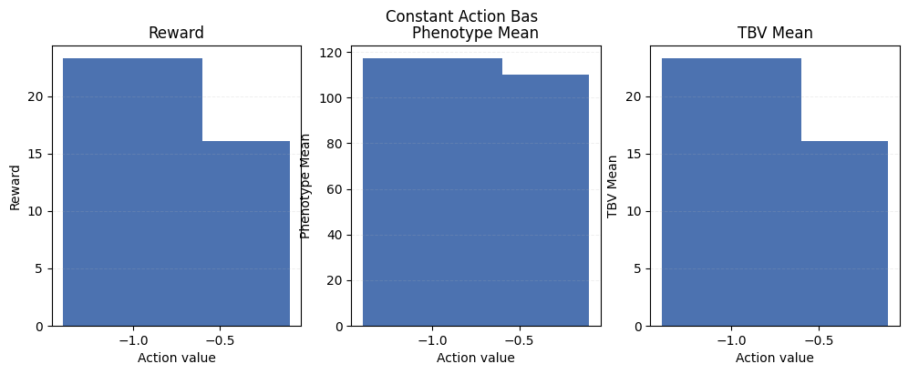
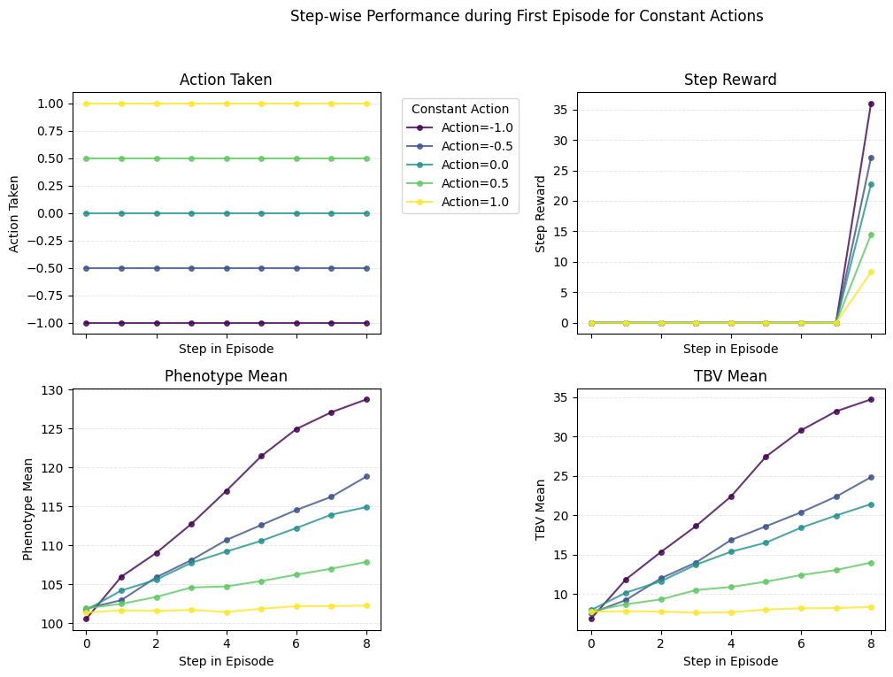
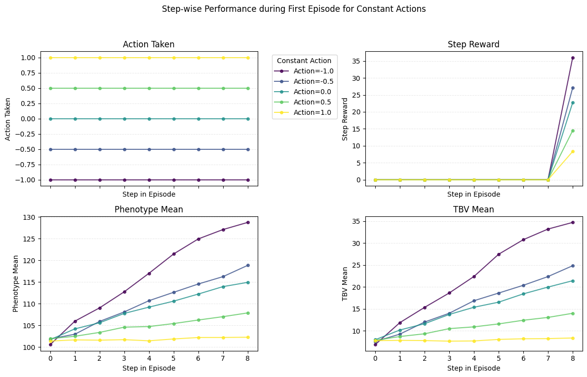

<!-- WARNING: THIS FILE WAS AUTOGENERATED! DO NOT EDIT! -->

``` python
import jax
import jax.numpy as jnp
import numpy as np
import pandas as pd
import matplotlib.pyplot as plt
from IPython.display import display

from chewc.gym import StoaEnv
from chewc.pheno import calculate_phenotypes

plt.style.use('tableau-colorblind10')


def run_constant_action_episode(env: StoaEnv, action_value: float, rng_key: jax.Array):
    params = env.default_params
    reset_key, rng_key = jax.random.split(rng_key)
    _, state = env.reset_env(reset_key, params)

    action = jnp.array([action_value], dtype=jnp.float32)
    final_reward = 0.0

    while True:
        rng_key, step_key = jax.random.split(rng_key)
        _, state, reward, done, _ = env.step_env(step_key, state, action, params)
        final_reward = float(reward)
        if bool(done):
            break

    phenokey, _ = jax.random.split(state.key)
    phenotypes, tbv = calculate_phenotypes(
        phenokey,
        population=state.population,
        trait=env.trait_architecture,
        heritability=env.heritabilities,
    )

    phenotypes = np.asarray(phenotypes[:, 0])
    tbv = np.asarray(tbv[:, 0])
    return final_reward, float(phenotypes.mean()), float(tbv.mean())


def evaluate_constant_actions(
    env: StoaEnv,
    action_values,
    num_episodes: int = 32,
    seed: int = 0,
) -> pd.DataFrame:
    rng = jax.random.PRNGKey(seed)
    records = []

    for action in action_values:
        rewards = []
        phenotype_means = []
        tbv_means = []

        for _ in range(num_episodes):
            rng, episode_key = jax.random.split(rng)
            reward, phenotype_mean, tbv_mean = run_constant_action_episode(
                env, action, episode_key
            )
            rewards.append(reward)
            phenotype_means.append(phenotype_mean)
            tbv_means.append(tbv_mean)

        records.append(
            {
                'action': float(action),
                'reward_mean': float(np.mean(rewards)),
                'reward_std': float(np.std(rewards, ddof=1)) if num_episodes > 1 else 0.0,
                'phenotype_mean': float(np.mean(phenotype_means)),
                'phenotype_std': float(np.std(phenotype_means, ddof=1)) if num_episodes > 1 else 0.0,
                'tbv_mean': float(np.mean(tbv_means)),
                'tbv_std': float(np.std(tbv_means, ddof=1)) if num_episodes > 1 else 0.0,
            }
        )

    return pd.DataFrame.from_records(records)

gym = StoaEnv(total_gen=5)

baseline_actions = [-1.0, -0.5]
baseline_df = evaluate_constant_actions(gym, baseline_actions, num_episodes=5, seed=0)
display(baseline_df)

fig, axes = plt.subplots(1, 3, figsize=(12, 4), sharex=True)
metrics = [
    ('reward_mean', 'Reward'),
    ('phenotype_mean', 'Phenotype Mean'),
    ('tbv_mean', 'TBV Mean'),
]

for ax, (column, title) in zip(axes, metrics):
    ax.bar(baseline_df['action'], baseline_df[column], color='#4c72b0')
    ax.set_title(title)
    ax.set_xlabel('Action value')
    ax.set_xticks(baseline_df['action'])
    ax.set_ylabel(title)
    ax.grid(axis='y', alpha=0.2, linestyle='--', linewidth=0.7)

fig.suptitle('Constant Action Bas')
def run_constant_action_episode(env: StoaEnv, action_value: float, rng_key: jax.Array):
    """Runs a single episode with a constant action and tracks step-wise data."""
    params = env.default_params
    reset_key, rng_key = jax.random.split(rng_key)
    _, state = env.reset_env(reset_key, params)

    action = jnp.array([action_value], dtype=jnp.float32)

    # Lists to store step-wise data
    step_rewards = []
    step_phenotype_means = []
    step_tbv_means = []
    step_actions = [] # Store action at each step
    steps = []       # Store step number

    current_step = 0
    while True:
        rng_key, step_key = jax.random.split(rng_key)
        phenokey, rng_key = jax.random.split(rng_key) # Need a key for phenotype calculation each step

        # Calculate metrics *before* taking the step to align with step number
        current_phenotypes, current_tbv = calculate_phenotypes(
            phenokey,
            population=state.population,
            trait=env.trait_architecture,
            heritability=env.heritabilities,
        )
        step_phenotype_means.append(float(jnp.asarray(current_phenotypes[:, 0]).mean()))
        step_tbv_means.append(float(jnp.asarray(current_tbv[:, 0]).mean()))
        step_actions.append(action_value) # Store the constant action
        steps.append(current_step)

        # Environment step
        _, state, reward, done, _ = env.step_env(step_key, state, action, params)
        step_rewards.append(float(reward)) # Store reward received *after* the step

        current_step += 1

        if bool(done):
            # Record final state metrics if needed (or adjust logic based on when metrics should reflect state)
            # For simplicity here, we stop after the 'done' flag is True
            break

    # Final metrics calculation (optional, depending on what 'final_reward' represents)
    # phenokey_final, _ = jax.random.split(state.key)
    # phenotypes_final, tbv_final = calculate_phenotypes(
    #     phenokey_final,
    #     population=state.population,
    #     trait=env.trait_architecture,
    #     heritability=env.heritabilities,
    # )
    # final_phenotype_mean = float(jnp.asarray(phenotypes_final[:, 0]).mean())
    # final_tbv_mean = float(jnp.asarray(tbv_final[:, 0]).mean())
    final_reward = step_rewards[-1] # Example: use the last reward

    # Return step-wise data along with final metrics
    step_data = pd.DataFrame({
        'step': steps,
        'action': step_actions,
        'reward': step_rewards, # Note: reward list might be one shorter if not recorded after final step before break
        'phenotype_mean': step_phenotype_means,
        'tbv_mean': step_tbv_means
    })

    # Adjust reward list length if necessary
    if len(step_rewards) < len(steps):
         step_data = step_data.iloc[:-1].copy() # Drop last row if reward list is shorter
         step_data['reward'] = step_rewards


    return final_reward, step_data # Return final reward and the DataFrame of step data


def evaluate_constant_actions(
    env: StoaEnv,
    action_values,
    num_episodes: int = 32,
    seed: int = 0,
) -> pd.DataFrame:
    """Evaluates constant actions, collecting step-wise data for the first episode of each action."""
    rng = jax.random.PRNGKey(seed)
    # records = [] # Keeping this if you still want summary stats
    all_step_data = [] # List to store step data DataFrames

    for action in action_values:
        rewards = []
        # phenotype_means = [] # For summary stats if needed
        # tbv_means = [] # For summary stats if needed
        first_episode_step_data = None

        for i in range(num_episodes):
            rng, episode_key = jax.random.split(rng)
            final_reward, step_data = run_constant_action_episode(
                env, action, episode_key
            )
            rewards.append(final_reward)
            # phenotype_means.append(step_data['phenotype_mean'].iloc[-1]) # Example: final phenotype mean
            # tbv_means.append(step_data['tbv_mean'].iloc[-1]) # Example: final tbv mean

            if i == 0: # Store step data only for the first episode
                step_data['action_value'] = float(action) # Add action value column for grouping/labeling
                step_data['episode'] = i # Add episode identifier
                first_episode_step_data = step_data

        all_step_data.append(first_episode_step_data)

        # If you still need the summary DataFrame, uncomment and adjust this part
        # records.append(
        #     {
        #         'action': float(action),
        #         'reward_mean': float(np.mean(rewards)),
        #         'reward_std': float(np.std(rewards, ddof=1)) if num_episodes > 1 else 0.0,
        #         'phenotype_mean': float(np.mean(phenotype_means)),
        #         'phenotype_std': float(np.std(phenotype_means, ddof=1)) if num_episodes > 1 else 0.0,
        #         'tbv_mean': float(np.mean(tbv_means)),
        #         'tbv_std': float(np.std(tbv_means, ddof=1)) if num_episodes > 1 else 0.0,
        #     }
        # )

    # Concatenate step data from the first episode of each action
    combined_step_data = pd.concat(all_step_data, ignore_index=True)

    # return pd.DataFrame.from_records(records) # Return summary if needed
    return combined_step_data


# --- Simulation & Plotting ---
gym = StoaEnv(total_gen=10) # Increase generations for a longer plot

baseline_actions = [-1.0, -0.5, 0.0, 0.5, 1.0] # Evaluate more actions
step_wise_df = evaluate_constant_actions(gym, baseline_actions, num_episodes=5, seed=0) # Run simulation

# --- New Plotting Logic ---
fig, axes = plt.subplots(2, 2, figsize=(12, 8), sharex=True) # Changed to 2x2 grid
axes = axes.flatten() # Flatten axes array for easy iteration

metrics_to_plot = [
    ('action', 'Action Taken'),
    ('reward', 'Step Reward'),
    ('phenotype_mean', 'Phenotype Mean'),
    ('tbv_mean', 'TBV Mean'),
]

# Group data by the constant action value used for the episode
grouped_data = step_wise_df.groupby('action_value')

# Define colors (optional, but helps distinguish lines)
colors = plt.cm.viridis(np.linspace(0, 1, len(baseline_actions)))

for ax, (column, title) in zip(axes, metrics_to_plot):
    for i, (action_val, group) in enumerate(grouped_data):
        ax.plot(group['step'], group[column], marker='o', linestyle='-', label=f'Action={action_val}', color=colors[i], markersize=4, alpha=0.8)
    ax.set_title(title)
    ax.set_xlabel('Step in Episode')
    ax.set_ylabel(title)
    ax.grid(axis='y', alpha=0.3, linestyle='--', linewidth=0.7)
    if column == 'action': # Keep legend only on the first plot for clarity
         ax.legend(title="Constant Action", bbox_to_anchor=(1.05, 1), loc='upper left')
    #else:
    #     ax.legend().set_visible(False)


# Remove legend from other plots if created automatically and adjust layout
# for ax in axes[1:]:
#      if ax.get_legend():
#           ax.get_legend().remove()

fig.suptitle('Step-wise Performance during First Episode for Constant Actions')
fig.tight_layout(rect=[0, 0.03, 0.85, 0.95]) # Adjust layout to make space for legend outside

plt.show()

# Display the collected step-wise data
print("\nStep-wise data for the first episode of each action:")
display(step_wise_df)
fig.tight_layout(rect=[0, 0.03, 1, 0.95])
fig
```

    /home/glect/.local/lib/python3.10/site-packages/matplotlib/projections/__init__.py:63: UserWarning: Unable to import Axes3D. This may be due to multiple versions of Matplotlib being installed (e.g. as a system package and as a pip package). As a result, the 3D projection is not available.
      warnings.warn("Unable to import Axes3D. This may be due to multiple versions of "
    WARNING:2025-10-26 20:54:22,525:jax._src.xla_bridge:794: An NVIDIA GPU may be present on this machine, but a CUDA-enabled jaxlib is not installed. Falling back to cpu.

<div>
<style scoped>
    .dataframe tbody tr th:only-of-type {
        vertical-align: middle;
    }
&#10;    .dataframe tbody tr th {
        vertical-align: top;
    }
&#10;    .dataframe thead th {
        text-align: right;
    }
</style>

<table class="dataframe" data-quarto-postprocess="true" data-border="1">
<thead>
<tr style="text-align: right;">
<th data-quarto-table-cell-role="th"></th>
<th data-quarto-table-cell-role="th">action</th>
<th data-quarto-table-cell-role="th">reward_mean</th>
<th data-quarto-table-cell-role="th">reward_std</th>
<th data-quarto-table-cell-role="th">phenotype_mean</th>
<th data-quarto-table-cell-role="th">phenotype_std</th>
<th data-quarto-table-cell-role="th">tbv_mean</th>
<th data-quarto-table-cell-role="th">tbv_std</th>
</tr>
</thead>
<tbody>
<tr>
<td data-quarto-table-cell-role="th">0</td>
<td>-1.0</td>
<td>23.264389</td>
<td>1.084688</td>
<td>117.199397</td>
<td>1.136008</td>
<td>23.264388</td>
<td>1.084688</td>
</tr>
<tr>
<td data-quarto-table-cell-role="th">1</td>
<td>-0.5</td>
<td>16.092931</td>
<td>1.000210</td>
<td>110.045973</td>
<td>0.950591</td>
<td>16.092930</td>
<td>1.000210</td>
</tr>
</tbody>
</table>

</div>






    Step-wise data for the first episode of each action:

<div>
<style scoped>
    .dataframe tbody tr th:only-of-type {
        vertical-align: middle;
    }
&#10;    .dataframe tbody tr th {
        vertical-align: top;
    }
&#10;    .dataframe thead th {
        text-align: right;
    }
</style>

<table class="dataframe" data-quarto-postprocess="true" data-border="1">
<thead>
<tr style="text-align: right;">
<th data-quarto-table-cell-role="th"></th>
<th data-quarto-table-cell-role="th">step</th>
<th data-quarto-table-cell-role="th">action</th>
<th data-quarto-table-cell-role="th">reward</th>
<th data-quarto-table-cell-role="th">phenotype_mean</th>
<th data-quarto-table-cell-role="th">tbv_mean</th>
<th data-quarto-table-cell-role="th">action_value</th>
<th data-quarto-table-cell-role="th">episode</th>
</tr>
</thead>
<tbody>
<tr>
<td data-quarto-table-cell-role="th">0</td>
<td>0</td>
<td>-1.0</td>
<td>0.000000</td>
<td>100.568954</td>
<td>6.842929</td>
<td>-1.0</td>
<td>0</td>
</tr>
<tr>
<td data-quarto-table-cell-role="th">1</td>
<td>1</td>
<td>-1.0</td>
<td>0.000000</td>
<td>105.982460</td>
<td>11.856910</td>
<td>-1.0</td>
<td>0</td>
</tr>
<tr>
<td data-quarto-table-cell-role="th">2</td>
<td>2</td>
<td>-1.0</td>
<td>0.000000</td>
<td>109.046364</td>
<td>15.333502</td>
<td>-1.0</td>
<td>0</td>
</tr>
<tr>
<td data-quarto-table-cell-role="th">3</td>
<td>3</td>
<td>-1.0</td>
<td>0.000000</td>
<td>112.755829</td>
<td>18.620100</td>
<td>-1.0</td>
<td>0</td>
</tr>
<tr>
<td data-quarto-table-cell-role="th">4</td>
<td>4</td>
<td>-1.0</td>
<td>0.000000</td>
<td>117.013939</td>
<td>22.373343</td>
<td>-1.0</td>
<td>0</td>
</tr>
<tr>
<td data-quarto-table-cell-role="th">5</td>
<td>5</td>
<td>-1.0</td>
<td>0.000000</td>
<td>121.475693</td>
<td>27.443542</td>
<td>-1.0</td>
<td>0</td>
</tr>
<tr>
<td data-quarto-table-cell-role="th">6</td>
<td>6</td>
<td>-1.0</td>
<td>0.000000</td>
<td>124.948555</td>
<td>30.765615</td>
<td>-1.0</td>
<td>0</td>
</tr>
<tr>
<td data-quarto-table-cell-role="th">7</td>
<td>7</td>
<td>-1.0</td>
<td>0.000000</td>
<td>127.105888</td>
<td>33.186596</td>
<td>-1.0</td>
<td>0</td>
</tr>
<tr>
<td data-quarto-table-cell-role="th">8</td>
<td>8</td>
<td>-1.0</td>
<td>36.006821</td>
<td>128.752426</td>
<td>34.700787</td>
<td>-1.0</td>
<td>0</td>
</tr>
<tr>
<td data-quarto-table-cell-role="th">9</td>
<td>0</td>
<td>-0.5</td>
<td>0.000000</td>
<td>101.899460</td>
<td>7.552630</td>
<td>-0.5</td>
<td>0</td>
</tr>
<tr>
<td data-quarto-table-cell-role="th">10</td>
<td>1</td>
<td>-0.5</td>
<td>0.000000</td>
<td>102.969513</td>
<td>9.237044</td>
<td>-0.5</td>
<td>0</td>
</tr>
<tr>
<td data-quarto-table-cell-role="th">11</td>
<td>2</td>
<td>-0.5</td>
<td>0.000000</td>
<td>105.919243</td>
<td>11.989704</td>
<td>-0.5</td>
<td>0</td>
</tr>
<tr>
<td data-quarto-table-cell-role="th">12</td>
<td>3</td>
<td>-0.5</td>
<td>0.000000</td>
<td>108.113495</td>
<td>13.995502</td>
<td>-0.5</td>
<td>0</td>
</tr>
<tr>
<td data-quarto-table-cell-role="th">13</td>
<td>4</td>
<td>-0.5</td>
<td>0.000000</td>
<td>110.697754</td>
<td>16.849983</td>
<td>-0.5</td>
<td>0</td>
</tr>
<tr>
<td data-quarto-table-cell-role="th">14</td>
<td>5</td>
<td>-0.5</td>
<td>0.000000</td>
<td>112.631218</td>
<td>18.598694</td>
<td>-0.5</td>
<td>0</td>
</tr>
<tr>
<td data-quarto-table-cell-role="th">15</td>
<td>6</td>
<td>-0.5</td>
<td>0.000000</td>
<td>114.551941</td>
<td>20.367624</td>
<td>-0.5</td>
<td>0</td>
</tr>
<tr>
<td data-quarto-table-cell-role="th">16</td>
<td>7</td>
<td>-0.5</td>
<td>0.000000</td>
<td>116.249001</td>
<td>22.356125</td>
<td>-0.5</td>
<td>0</td>
</tr>
<tr>
<td data-quarto-table-cell-role="th">17</td>
<td>8</td>
<td>-0.5</td>
<td>27.099379</td>
<td>118.846596</td>
<td>24.831596</td>
<td>-0.5</td>
<td>0</td>
</tr>
<tr>
<td data-quarto-table-cell-role="th">18</td>
<td>0</td>
<td>0.0</td>
<td>0.000000</td>
<td>101.708160</td>
<td>7.951654</td>
<td>0.0</td>
<td>0</td>
</tr>
<tr>
<td data-quarto-table-cell-role="th">19</td>
<td>1</td>
<td>0.0</td>
<td>0.000000</td>
<td>104.206635</td>
<td>10.176085</td>
<td>0.0</td>
<td>0</td>
</tr>
<tr>
<td data-quarto-table-cell-role="th">20</td>
<td>2</td>
<td>0.0</td>
<td>0.000000</td>
<td>105.609673</td>
<td>11.613831</td>
<td>0.0</td>
<td>0</td>
</tr>
<tr>
<td data-quarto-table-cell-role="th">21</td>
<td>3</td>
<td>0.0</td>
<td>0.000000</td>
<td>107.771088</td>
<td>13.721590</td>
<td>0.0</td>
<td>0</td>
</tr>
<tr>
<td data-quarto-table-cell-role="th">22</td>
<td>4</td>
<td>0.0</td>
<td>0.000000</td>
<td>109.215126</td>
<td>15.360993</td>
<td>0.0</td>
<td>0</td>
</tr>
<tr>
<td data-quarto-table-cell-role="th">23</td>
<td>5</td>
<td>0.0</td>
<td>0.000000</td>
<td>110.596100</td>
<td>16.520927</td>
<td>0.0</td>
<td>0</td>
</tr>
<tr>
<td data-quarto-table-cell-role="th">24</td>
<td>6</td>
<td>0.0</td>
<td>0.000000</td>
<td>112.234581</td>
<td>18.415419</td>
<td>0.0</td>
<td>0</td>
</tr>
<tr>
<td data-quarto-table-cell-role="th">25</td>
<td>7</td>
<td>0.0</td>
<td>0.000000</td>
<td>113.948418</td>
<td>19.960239</td>
<td>0.0</td>
<td>0</td>
</tr>
<tr>
<td data-quarto-table-cell-role="th">26</td>
<td>8</td>
<td>0.0</td>
<td>22.731907</td>
<td>114.928833</td>
<td>21.412189</td>
<td>0.0</td>
<td>0</td>
</tr>
<tr>
<td data-quarto-table-cell-role="th">27</td>
<td>0</td>
<td>0.5</td>
<td>0.000000</td>
<td>101.944054</td>
<td>7.822109</td>
<td>0.5</td>
<td>0</td>
</tr>
<tr>
<td data-quarto-table-cell-role="th">28</td>
<td>1</td>
<td>0.5</td>
<td>0.000000</td>
<td>102.495567</td>
<td>8.694190</td>
<td>0.5</td>
<td>0</td>
</tr>
<tr>
<td data-quarto-table-cell-role="th">29</td>
<td>2</td>
<td>0.5</td>
<td>0.000000</td>
<td>103.387657</td>
<td>9.316386</td>
<td>0.5</td>
<td>0</td>
</tr>
<tr>
<td data-quarto-table-cell-role="th">30</td>
<td>3</td>
<td>0.5</td>
<td>0.000000</td>
<td>104.598679</td>
<td>10.493571</td>
<td>0.5</td>
<td>0</td>
</tr>
<tr>
<td data-quarto-table-cell-role="th">31</td>
<td>4</td>
<td>0.5</td>
<td>0.000000</td>
<td>104.738632</td>
<td>10.893928</td>
<td>0.5</td>
<td>0</td>
</tr>
<tr>
<td data-quarto-table-cell-role="th">32</td>
<td>5</td>
<td>0.5</td>
<td>0.000000</td>
<td>105.427048</td>
<td>11.565787</td>
<td>0.5</td>
<td>0</td>
</tr>
<tr>
<td data-quarto-table-cell-role="th">33</td>
<td>6</td>
<td>0.5</td>
<td>0.000000</td>
<td>106.246368</td>
<td>12.401135</td>
<td>0.5</td>
<td>0</td>
</tr>
<tr>
<td data-quarto-table-cell-role="th">34</td>
<td>7</td>
<td>0.5</td>
<td>0.000000</td>
<td>107.019981</td>
<td>13.046627</td>
<td>0.5</td>
<td>0</td>
</tr>
<tr>
<td data-quarto-table-cell-role="th">35</td>
<td>8</td>
<td>0.5</td>
<td>14.492324</td>
<td>107.883369</td>
<td>13.987165</td>
<td>0.5</td>
<td>0</td>
</tr>
<tr>
<td data-quarto-table-cell-role="th">36</td>
<td>0</td>
<td>1.0</td>
<td>0.000000</td>
<td>101.393036</td>
<td>7.753517</td>
<td>1.0</td>
<td>0</td>
</tr>
<tr>
<td data-quarto-table-cell-role="th">37</td>
<td>1</td>
<td>1.0</td>
<td>0.000000</td>
<td>101.667000</td>
<td>7.811851</td>
<td>1.0</td>
<td>0</td>
</tr>
<tr>
<td data-quarto-table-cell-role="th">38</td>
<td>2</td>
<td>1.0</td>
<td>0.000000</td>
<td>101.596794</td>
<td>7.769296</td>
<td>1.0</td>
<td>0</td>
</tr>
<tr>
<td data-quarto-table-cell-role="th">39</td>
<td>3</td>
<td>1.0</td>
<td>0.000000</td>
<td>101.716324</td>
<td>7.635191</td>
<td>1.0</td>
<td>0</td>
</tr>
<tr>
<td data-quarto-table-cell-role="th">40</td>
<td>4</td>
<td>1.0</td>
<td>0.000000</td>
<td>101.447876</td>
<td>7.682395</td>
<td>1.0</td>
<td>0</td>
</tr>
<tr>
<td data-quarto-table-cell-role="th">41</td>
<td>5</td>
<td>1.0</td>
<td>0.000000</td>
<td>101.875923</td>
<td>8.031636</td>
<td>1.0</td>
<td>0</td>
</tr>
<tr>
<td data-quarto-table-cell-role="th">42</td>
<td>6</td>
<td>1.0</td>
<td>0.000000</td>
<td>102.213699</td>
<td>8.181685</td>
<td>1.0</td>
<td>0</td>
</tr>
<tr>
<td data-quarto-table-cell-role="th">43</td>
<td>7</td>
<td>1.0</td>
<td>0.000000</td>
<td>102.219627</td>
<td>8.212545</td>
<td>1.0</td>
<td>0</td>
</tr>
<tr>
<td data-quarto-table-cell-role="th">44</td>
<td>8</td>
<td>1.0</td>
<td>8.333740</td>
<td>102.276405</td>
<td>8.361144</td>
<td>1.0</td>
<td>0</td>
</tr>
</tbody>
</table>

</div>


