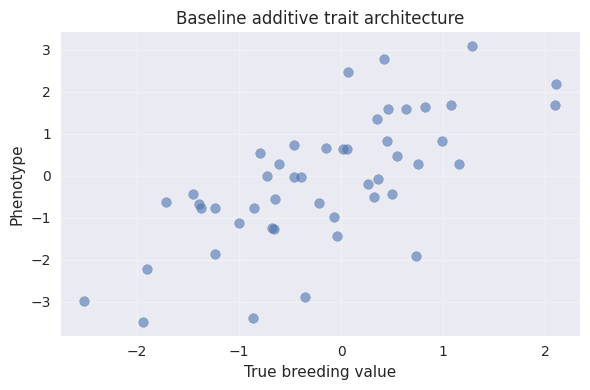

# Wright–Fisher v2 Setup


<!-- WARNING: THIS FILE WAS AUTOGENERATED! DO NOT EDIT! -->

We will: - simulate a founder population with
[`msprime_pop`](https://cjGO.github.io/chewc/structs.html#msprime_pop)
to get realistic haplotypes and a genetic map. - sample an additive-only
trait architecture scaled to a target additive variance. - draw noisy
phenotypes at a chosen heritability so the pipeline is ready for
downstream selection experiments.

``` python
import jax
import jax.numpy as jnp
import numpy as np
from numpy.random import default_rng
import msprime
import pandas as pd
import matplotlib.pyplot as plt

from typing import Optional, Tuple
from IPython.display import display

from chewc.structs import Population, GeneticMap, add_trait
from chewc.pheno import calculate_phenotypes

plt.style.use('seaborn-v0_8')
```

    /home/glect/.local/lib/python3.10/site-packages/matplotlib/projections/__init__.py:63: UserWarning: Unable to import Axes3D. This may be due to multiple versions of Matplotlib being installed (e.g. as a system package and as a pip package). As a result, the 3D projection is not available.
      warnings.warn("Unable to import Axes3D. This may be due to multiple versions of "

------------------------------------------------------------------------

<a href="https://github.com/cjGO/chewc/blob/main/chewc/structs.py#L147"
target="_blank" style="float:right; font-size:smaller">source</a>

### msprime_pop

>  msprime_pop (key:jax.Array, n_ind:int, n_chr:int, n_loci_per_chr:int,
>                   ploidy:int=2, effective_population_size:int=5000,
>                   mutation_rate:float=1e-07,
>                   recombination_rate_per_chr:float=1e-08,
>                   maf_threshold:float=0.05, base_chr_length:int=500000,
>                   num_simulated_individuals:Optional[int]=None,
>                   enforce_founder_maf:bool=True)

\*Simulate a padded founder population from an msprime ancestry model.

The output matches the lightweight
[`Population`](https://cjGO.github.io/chewc/structs.html#population)/[`GeneticMap`](https://cjGO.github.io/chewc/structs.html#geneticmap)
structures used by the workflow notebooks so it can plug straight into
trait sampling, phenotype simulation, and selection routines.\*

``` python
master_key = jax.random.PRNGKey(2024)
pop_key, trait_key, pheno_key = jax.random.split(master_key, 3)

founder_config = dict(
    n_ind=48,
    n_chr=3,
    n_loci_per_chr=40,
    mutation_rate=1e-7,
    recombination_rate_per_chr=1e-8,
    base_chr_length=500_000,
    effective_population_size=5_000,
    num_simulated_individuals=800,
    maf_threshold=0.05,
)

founder_pop, genetic_map = msprime_pop(pop_key, **founder_config)

print(f'Founder genotype array shape: {founder_pop.geno.shape}')
allele_counts = founder_pop.geno.sum(axis=2).reshape(founder_pop.geno.shape[0], -1)
print(f'Mean allele dosage across founders: {float(allele_counts.mean()):.2f}')
```

    WARNING:2025-10-23 15:49:57,995:jax._src.xla_bridge:794: An NVIDIA GPU may be present on this machine, but a CUDA-enabled jaxlib is not installed. Falling back to cpu.

    Founder genotype array shape: (48, 3, 2, 40)
    Mean allele dosage across founders: 0.62

``` python
map_summary = pd.DataFrame({
    'chromosome': np.repeat(np.arange(founder_config['n_chr']), founder_config['n_loci_per_chr']),
    'position_cM': np.concatenate([np.asarray(pos) for pos in genetic_map.locus_positions]),
})

display(map_summary.groupby('chromosome')['position_cM'].agg(['min', 'max', 'count']))
```

<div>
<style scoped>
    .dataframe tbody tr th:only-of-type {
        vertical-align: middle;
    }
&#10;    .dataframe tbody tr th {
        vertical-align: top;
    }
&#10;    .dataframe thead th {
        text-align: right;
    }
</style>

<table class="dataframe" data-quarto-postprocess="true" data-border="1">
<thead>
<tr style="text-align: right;">
<th data-quarto-table-cell-role="th"></th>
<th data-quarto-table-cell-role="th">min</th>
<th data-quarto-table-cell-role="th">max</th>
<th data-quarto-table-cell-role="th">count</th>
</tr>
<tr>
<th data-quarto-table-cell-role="th">chromosome</th>
<th data-quarto-table-cell-role="th"></th>
<th data-quarto-table-cell-role="th"></th>
<th data-quarto-table-cell-role="th"></th>
</tr>
</thead>
<tbody>
<tr>
<td data-quarto-table-cell-role="th">0</td>
<td>0.008855</td>
<td>0.490694</td>
<td>40</td>
</tr>
<tr>
<td data-quarto-table-cell-role="th">1</td>
<td>0.022942</td>
<td>0.481344</td>
<td>40</td>
</tr>
<tr>
<td data-quarto-table-cell-role="th">2</td>
<td>0.008968</td>
<td>0.499258</td>
<td>40</td>
</tr>
</tbody>
</table>

</div>

``` python
trait = add_trait(
    key=trait_key,
    founder_pop=founder_pop,
    n_qtl_per_chr=6,
    mean=jnp.array([0.0]),
    var_a=jnp.array([1.0]),
    var_d=jnp.array([0.0]),
    sigma=jnp.array([[1.0]], dtype=jnp.float32),
)

print(f'Total QTL sampled: {trait.qtl_effects.shape[0]}')
print(f'Trait intercept: {float(trait.intercept[0]):.3f}')
```

    Total QTL sampled: 18
    Trait intercept: 0.173

``` python
heritability = jnp.array([0.4], dtype=jnp.float32)
phenotypes, tbv = calculate_phenotypes(
    key=pheno_key,
    population=founder_pop,
    trait=trait,
    heritability=heritability,
)

results = pd.DataFrame({
    'phenotype': np.asarray(phenotypes[:, 0]),
    'tbv': np.asarray(tbv[:, 0]),
})

display(results.describe().T[['mean', 'std']])
print(f"Correlation (phenotype, TBV): {results.corr().loc['phenotype', 'tbv']:.3f}")

plt.figure(figsize=(6, 4))
plt.scatter(results['tbv'], results['phenotype'], alpha=0.6)
plt.xlabel('True breeding value')
plt.ylabel('Phenotype')
plt.title('Baseline additive trait architecture')
plt.grid(True, alpha=0.3)
plt.tight_layout()
```

<div>
<style scoped>
    .dataframe tbody tr th:only-of-type {
        vertical-align: middle;
    }
&#10;    .dataframe tbody tr th {
        vertical-align: top;
    }
&#10;    .dataframe thead th {
        text-align: right;
    }
</style>

<table class="dataframe" data-quarto-postprocess="true" data-border="1">
<thead>
<tr style="text-align: right;">
<th data-quarto-table-cell-role="th"></th>
<th data-quarto-table-cell-role="th">mean</th>
<th data-quarto-table-cell-role="th">std</th>
</tr>
</thead>
<tbody>
<tr>
<td data-quarto-table-cell-role="th">phenotype</td>
<td>-0.108091</td>
<td>1.537079</td>
</tr>
<tr>
<td data-quarto-table-cell-role="th">tbv</td>
<td>-0.173355</td>
<td>1.010582</td>
</tr>
</tbody>
</table>

</div>

    Correlation (phenotype, TBV): 0.693


